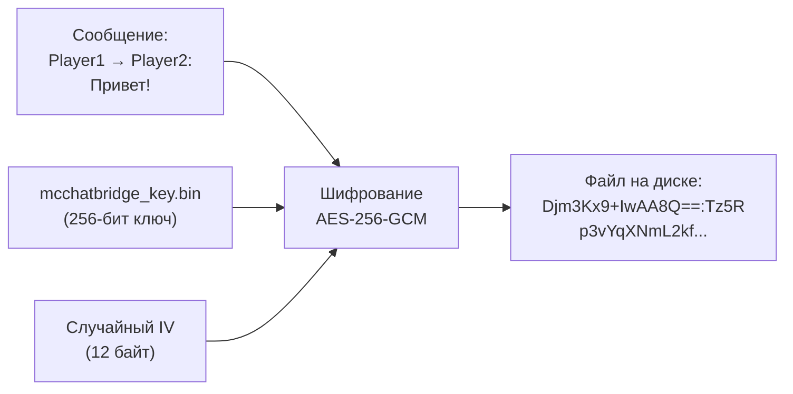

# McChatBridge — Документация мода

**Версия:** 1.0.0 · **Платформа:** NeoForge 1.21.1 · **Лицензия:** MIT

---

## Что делает мод

McChatBridge поднимает встроенный HTTP веб-сервер прямо внутри Minecraft-сервера. Через браузер игроки (и не только) могут:

- 💬 **Читать и писать в общий чат** — сообщения синхронизируются в обе стороны: из веба в игру и из игры в веб
- 🔒 **Отправлять личные сообщения** (PM) конкретным игрокам на сервере — история ЛС шифруется AES-256-GCM
- 📎 **Загружать и отправлять изображения** — картинки показываются в веб-чате, а в игре появляется кликабельная ссылка
- ⛏️ **Играть в мини-игру «Кликер»** — добывать руду нажатиями, получать ресурсы в инвентарь и передавать их игрокам на сервере
- 👥 **Видеть онлайн-игроков** в реальном времени с их аватарами
- 📡 **Получать системные уведомления** о входе/выходе игроков и смертях

Веб-интерфейс — это полноценное одностраничное приложение (SPA) с тёмной темой, анимациями, и адаптивным дизайном под мобильные устройства.

---

## Структура файлов

Все файлы мода располагаются внутри директории сервера:

```

├── mods\
│   └── mcchatbridge-1.0.0.jar          ← Скомпилированный мод
│
└── config\
    ├── mcchatbridge.json                ← Главный конфиг (настройки)
    ├── mcchatbridge_key.bin             ← 🔐 Ключ шифрования AES-256 (генерируется автоматически)
    ├── mcchatbridge_history.txt         ← История общего чата (до 100 сообщений, открытый текст)
    ├── mcchatbridge_private.txt         ← История личных сообщений (зашифрована)
    ├── mcchatbridge_clicker.txt         ← Сохранённые инвентари кликера
    ├── mcchatbridge_avatars\            ← Аватарки пользователей веба
    │   └── <nick>.png / .jpg            ← Загруженные аватарки
    └── mcchatbridge_uploads\            ← Загруженные изображения
        └── upload_<uuid>.jpg / .png     ← Файлы картинок
```

### Описание файлов

| Файл | Описание |
|------|----------|
| [mcchatbridge-1.0.0.jar](mods/mcchatbridge-1.0.0.jar) | Готовый JAR-файл мода, кладётся в папку `mods/` |
| [mcchatbridge.json](config/mcchatbridge.json) | Основной конфиг — порт, флаги фич, настройки руд |
| `mcchatbridge_key.bin` | 🔐 Бинарный ключ AES-256 для шифрования личных сообщений. Генерируется при первом запуске |
| `mcchatbridge_history.txt` | Автосохранение истории общего чата (до 100 последних сообщений). Создаётся автоматически |
| `mcchatbridge_private.txt` | Зашифрованная история личных сообщений. Нечитаема без `mcchatbridge_key.bin` |
| `mcchatbridge_clicker.txt` | Инвентари кликера по никнеймам. Создаётся автоматически |
| `mcchatbridge_avatars/` | Папка с аватарками пользователей веб-чата |
| `mcchatbridge_uploads/` | Папка с загруженными изображениями |

> [!NOTE]
> **Все файлы** создаются автоматически при первом запуске сервера. На Modrinth загружается только `mcchatbridge-1.0.0.jar`. Единственный файл, который имеет смысл редактировать вручную — `mcchatbridge.json`.

---

## Шифрование личных сообщений

История личных сообщений (файл `mcchatbridge_private.txt`) зашифрована алгоритмом **AES-256-GCM** — тем же, который используется в банковских системах и TLS.

### Как это работает



| Аспект | Детали |
|--------|--------|
| **Алгоритм** | AES-256-GCM (аутентифицированное шифрование) |
| **Размер ключа** | 256 бит |
| **Вектор инициализации** | 12 байт, случайный, уникальный для каждого сообщения |
| **Тег аутентификации** | 128 бит — защита от подмены данных |
| **Формат строки** | `base64(IV):base64(ciphertext+tag)` |

### Файл ключа

- **Путь:** `config/mcchatbridge_key.bin`
- Генерируется **автоматически** при первом запуске (если отсутствует)
- При последующих запусках — загружается из файла
- В консоли сервера видно:
  - `[McChatBridge] New AES-256 encryption key generated and saved.` — при генерации
  - `[McChatBridge] Private message encryption key loaded.` — при загрузке

> [!CAUTION]
> Если удалить `mcchatbridge_key.bin`, вся ранее сохранённая история личных сообщений станет **навсегда нечитаемой**. Рекомендуется сделать бэкап этого файла.

> [!WARNING]
> Ключ шифрования хранится на том же сервере, что и данные. Это защита от **случайного просмотра** файла истории — администратор не увидит текст, просто открыв `mcchatbridge_private.txt`. Однако это не защита от целенаправленной атаки: имея доступ к серверу, можно извлечь и ключ.

---

## Исходный код

Мод состоит из двух Java-файлов:

| Файл | Строк | Назначение |
|------|-------|------------|
| [McChatBridge.java](src/main/java/com/example/mcchatbridge/McChatBridge.java) | 123 | Точка входа мода. Регистрирует обработчики событий NeoForge: чат, подключение/отключение игроков, смерть |
| [HttpWebServer.java](src/main/java/com/example/mcchatbridge/HttpWebServer.java) | ~3200 | Встроенный HTTP-сервер, веб-интерфейс (HTML/CSS/JS), все API-эндпоинты, кликер, загрузка файлов, конфигурация, шифрование |

---

## Конфигурация

Конфигурационный файл: [config/mcchatbridge.json](config/mcchatbridge.json)

Если файл не существует — он будет создан автоматически с настройками по умолчанию при первом запуске сервера.

### Общие настройки

```json
{
  "port": 8080,
  "clickerEnabled": true,
  "allowImageUploads": true
}
```

| Параметр | Тип | По умолчанию | Описание |
|----------|-----|-------------|----------|
| `port` | `int` | `8080` | Порт, на котором запускается веб-сервер. Веб-интерфейс будет доступен по адресу `http://<ip>:<port>` |
| `clickerEnabled` | `boolean` | `true` | Включает/выключает мини-игру «Кликер». При `false` — кнопка ⛏️ скрывается в интерфейсе, а API-запросы к кликеру возвращают HTTP 403 |
| `allowImageUploads` | `boolean` | `true` | Включает/выключает загрузку изображений. При `false` — кнопка 📎 скрывается, а `/upload` возвращает HTTP 403 |

### Настройки руд (ores)

Массив `ores` определяет, какие руды доступны в мини-игре кликера, их характеристики и вероятности выпадения:

```json
{
  "ores": [
    {
      "id": "coal",
      "itemId": "minecraft:coal",
      "name": "Coal",
      "color": "#707070",
      "hits": 2,
      "weight": 30.0
    }
  ]
}
```

| Поле | Тип | Описание |
|------|-----|----------|
| `id` | `string` | Уникальный идентификатор руды (используется внутри системы) |
| `itemId` | `string` | ID предмета Minecraft (например `minecraft:diamond`). Используется при передаче предметов игрокам на сервер |
| `name` | `string` | Отображаемое имя руды в веб-интерфейсе |
| `color` | `string` | Цвет руды в HEX-формате для отображения в интерфейсе кликера |
| `hits` | `int` | Количество кликов, необходимое для добычи одной единицы руды |
| `weight` | `double` | Вес (вероятность) выпадения руды. Чем выше значение — тем чаще руда выпадает |

#### Руды по умолчанию

| Руда | Кликов | Вес | Шанс ≈ |
|------|--------|-----|--------|
| Coal | 2 | 30.0 | 30.0% |
| Lapis | 3 | 25.0 | 25.0% |
| Redstone | 3 | 25.0 | 25.0% |
| Iron | 3 | 14.0 | 14.0% |
| Diamond | 5 | 5.8 | 5.8% |
| Netherite Block | 100 | 0.2 | 0.2% |

> [!TIP]
> Шансы рассчитываются автоматически как доля от суммы всех весов. Если суммарный вес = 100, то `weight` фактически равен проценту. Можно добавлять собственные руды — просто добавьте новый объект в массив.

---

## Примеры настройки

### Отключить кликер и загрузку картинок

```json
{
  "port": 8080,
  "clickerEnabled": false,
  "allowImageUploads": false,
  "ores": []
}
```

### Сменить порт на 3000

```json
{
  "port": 3000,
  "clickerEnabled": true,
  "allowImageUploads": true,
  "ores": [...]
}
```

### Добавить свою руду

Добавьте новый объект в массив `ores`:

```json
{
  "id": "emerald",
  "itemId": "minecraft:emerald",
  "name": "Emerald",
  "color": "#50c878",
  "hits": 4,
  "weight": 8.0
}
```

> [!IMPORTANT]
> После изменения конфига необходимо **перезапустить сервер** — конфигурация загружается один раз при старте.

---

## API-эндпоинты

Веб-сервер предоставляет следующие HTTP-эндпоинты:

| Метод | Путь | Описание |
|-------|------|----------|
| GET | `/` | Главная страница — веб-интерфейс чата |
| GET | `/stream` | SSE-поток (Server-Sent Events) для получения сообщений в реальном времени |
| GET | `/history` | История общего чата (JSON) |
| POST | `/send` | Отправить сообщение в общий чат |
| GET | `/players` | Список онлайн-игроков (JSON) |
| GET | `/server-info` | Информация о сервере: MOTD, онлайн, макс. игроков, статусы фич |
| GET | `/private/history` | История личных сообщений (расшифровывается на лету) |
| POST | `/private/send` | Отправить личное сообщение |
| POST | `/leave` | Покинуть чат (удалить сессию) |
| GET | `/clicker/status` | Статус кликера: текущий блок, прогресс, инвентарь |
| POST | `/clicker/click` | Клик по блоку |
| POST | `/clicker/transfer` | Передать ресурсы из кликера игроку на сервере |
| POST | `/upload` | Загрузить изображение |
| GET | `/uploads/*` | Получить загруженное изображение |
| POST | `/avatar/upload` | Загрузить аватарку |
| GET | `/avatar/*` | Получить аватарку |
| GET | `/icon` | Иконка сервера (server-icon.png) |
| GET | `/panorama/*` | Панорамные изображения для фона |

---

## Безопасность

| Компонент | Защита |
|-----------|--------|
| Общий чат | Хранится в открытом виде (`mcchatbridge_history.txt`) — публичная информация |
| Личные сообщения | **AES-256-GCM** шифрование на диске. Администратор сервера не может прочитать файл `mcchatbridge_private.txt` без ключа |
| Ключ шифрования | `mcchatbridge_key.bin` — 256-битный AES-ключ, генерируется при первом запуске |
| Загруженные файлы | Хранятся с уникальными UUID-именами, доступны по прямой ссылке |

---

## Как установить

1. Скопируйте `mcchatbridge-1.0.0.jar` в папку `mods/` вашего NeoForge 1.21.1 сервера
2. Запустите сервер — конфиг `config/mcchatbridge.json` и ключ шифрования `config/mcchatbridge_key.bin` создадутся автоматически
3. (Опционально) Отредактируйте конфиг под свои нужды и перезапустите сервер
4. (Рекомендуется) Сделайте бэкап `config/mcchatbridge_key.bin` в безопасное место
5. Откройте в браузере `http://<ip-сервера>:8080`
